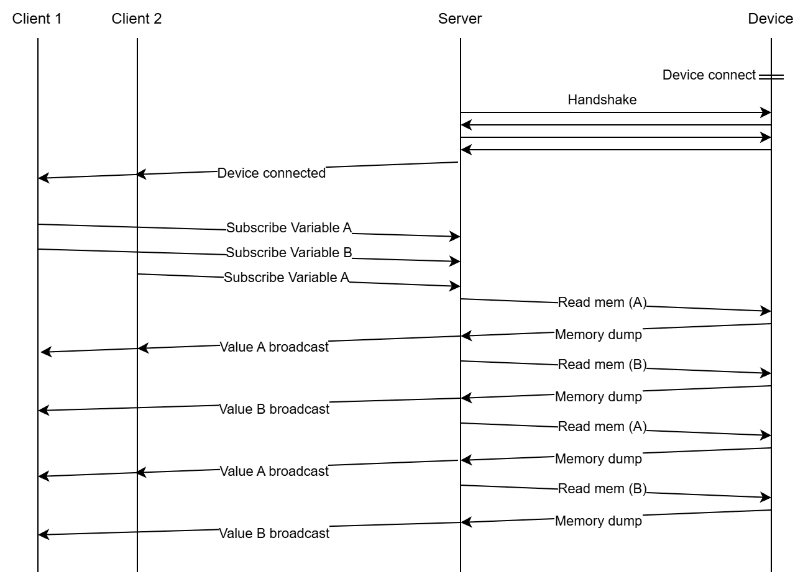
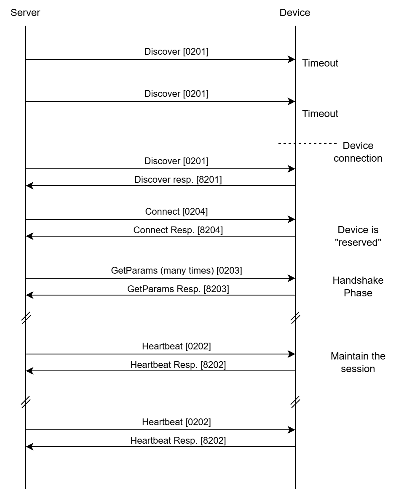

.. _page_architecture:

Architecture
============

Scrutiny is a framework for debugging, testing and visualizing embedded C++ applications.
It works through instrumentation, meaning that the access to the device requires a modified firmware to work.

the design of the application uses a client/server architecture allowing multiple clients or processes to
interract with an embedded device at the same time.

The architecture of the Scrutiny ecosystem is depicted as below

.. figure:: _static/global_architecture.png

    The Scrutiny architecture

- On the left we have the clients, those are the GUI and test scripts that runs on the user PC.
- On the right, we have the embedded firmware in the device we are debugging.
- In the middle, a server that arbitrates the client requests and keep an active communication with the device.

Classical vs intrumentation based debugging
-------------------------------------------

Debugging by instrumentation is different from common classical debugging of embedded firwmares.

In the traditional approach, the device is accessed through a dedicated debug port using a protocol such as
:ref:`SWD<glossary>` or :ref:`JTAG<glossary>` using a debug probe.

When debugging by intrumentation, the debug probe is not necessary. We use instead any peripheral capable of
data transfer and use it to communicate with a debugging library. The presence of debugging library in the
embedded firmware is the part that is instrumented.

.. figure:: _static/debug_classical_vs_instrumentation.png

    Classical debugging V.S. debugging by instrumentation

Both methods have pros and cons. Here is a comparison

.. list-table:: Debugging method comparison
  :header-rows: 1
  :align: left
  :width: 100%

  * - Feature
    - Classical debugging
    - Instrumentation based
  * - Code stepping
    - Possible (+)
    - Impossible (-)
  * - Non-intrusive memory access
    - Depends on debug module
    - Yes (+)
  * - Local variable access
    - Possible (+)
    - Impossible (-)
  * - Global/Static variable access
    - Possible (+)
    - Possible (+)
  * - Require a debug probe
    - Yes (-)
    - No (+)
  * - Memory accesses
    - Async with firmware (-)
    - Synchronous with firmware (+)

Debugging by instrumentation is an ideal tool for debugging a real-time baremetal application while it is running,
but it's not suited to do the initial bootup of a new platform as it require a firmware that boots and can make a transceiver work.

Update Stream Timing Diagram
----------------------------

Below is a timing diagram that depicts 2 clients subscribing to variables and receiving a continuous stream of updates from the server.

    Overall timing diagram

.. note:: Altough central, subscribing to an update stream is only a one of many features supported by Scrutiny.

Device protocol
---------------

The communication between the server and the device is done through a custom binary protocol.
The protocol is half-duplex and works in a request/response scheme.
It draws inspiration from the UDS protocol used in the automotive industry defined by ISO-14229.

Each request includes a command ID, a sub-function ID, and a CRC32 checksum.
Any request received by the device with an invalid CRC32 value is silently ignored.

The communication sequence proceeds as follows:

1. The server continuously searches for a device. As soon as a device responds to a ``Discover``
   request, the server attempts to establish a connection by sending a ``Connect`` message.

2. When a ``Connect`` message is acknowledged by the device, the firmware starts a session.
   Any subsequent ``Connect`` messages are rejected.
   This ensures that only one server at a time can claim ownership of the device.

3. The server must periodically send ``Heartbeat`` messages to keep the session active.
   The session ends when the device receives a Disconnect message or when no ``Heartbeat`` messages
   are received for a defined timeout period.

4. Once the connection is established, the server sends a series of
   ``Get-Params`` messages to retrieve the device's configuration and capabilities.

    Server/Device communication timing diagram

The detailed protocol specification is not included in this manual.
Instead, a dedicated webpage has been created to present the information in a more
accessible and easy-to-navigate format.

See `the device protocol page <https://scrutinydebugger.com/doc-device-protocol.html>`__
