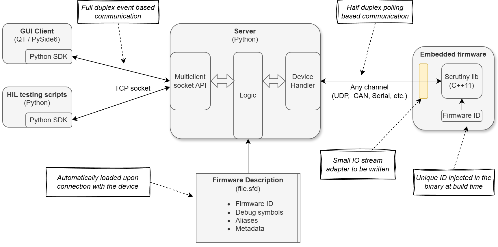
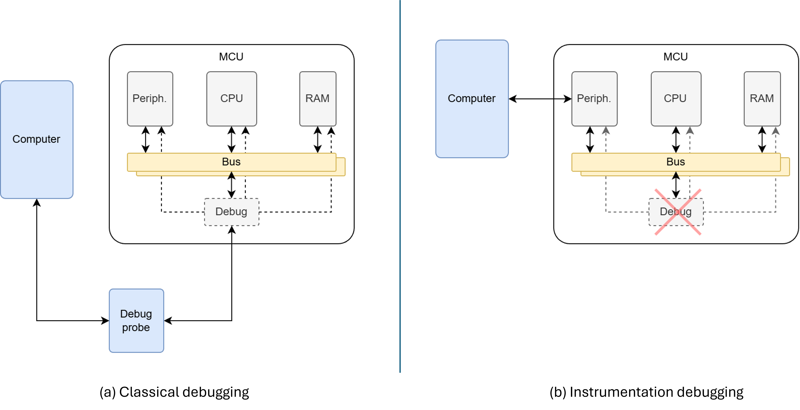

.. _page_architecture:

Architecture
============

Scrutiny is a framework for debugging, testing and visualizing embedded C++ applications.
It works through instrumentation, meaning that the access to the device requires a modified firmware to work.

the design of the application uses a client/server architecture allowing multiple clients or processes to
interract with an embedded device at the same time.

The architecture of the Scrutiny ecosystem is depicted as below

    The Scrutiny architecture

- On the left we have the clients, those are the GUI and test scripts that runs on the user PC.
- On the right, we have the embedded firmware in the device we are debugging.
- In the middle, a server that arbitrates the client requests and keep an active communication with the device.

Classical vs intrumentation based debugging
-------------------------------------------

Debugging by instrumentation is different from common classical debugging of embedded firwmares.

In the traditional approach, the device is accessed through a dedicated debug port using a protocol such as
:ref:`SWD<glossary>` or :ref:`JTAG<glossary>` using a debug probe.

When debugging by intrumentation, the debug probe is not necessary. We use instead any peripheral capable of
data transfer and use it to communicate with a debugging library. The presence of debugging library in the
embedded firmware is the part that is instrumented.

    Classical debugging V.S. debugging by instrumentation

Both methods have pros and cons. Here is a comparison

.. list-table:: Debugging method comparison
  :header-rows: 1
  :align: left
  :width: 100%

  * - Feature
    - Classical debugging
    - Instrumentation based
  * - Code stepping
    - Possible (+)
    - Impossible (-)
  * - Non-intrusive memory access
    - Depends on debug module
    - Yes (+)
  * - Local variable access
    - Possible (+)
    - Impossible (-)
  * - Global/Static variable access
    - Possible (+)
    - Possible (+)
  * - Require a debug probe
    - Yes (-)
    - No (+)
  * - Memory accesses
    - Async with firmware
    - Synchronous with firmware
