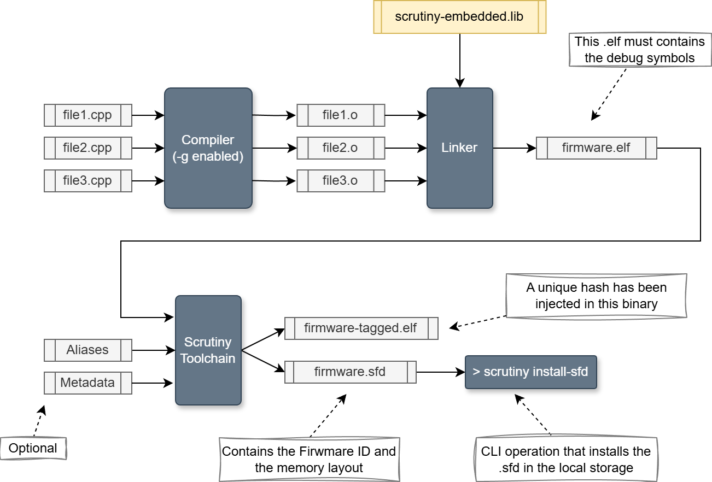

Command Line Interface (CLI)
============================

Basic Usage
-----------

The Scrutiny Command Line Interface (CLI) is the primary entry point for all functionality provided by the host system.

All commands support the following argument for controlling log output:

.. list-table:: Logging options
  :header-rows: 0
  :align: left

  * - \-\-loglevel
    - Controls the logging level. Valid values are: critical, error, warning, info, debug, dumpdata.
  * - \-\-logfile
    - Redirects log output to a file instead of standard output.
  * - \-\-disable-loggers
    - Allows the user to hide specific loggers to reduce noise in the output.

Here is an example of log output produced from the command line:

.. code-block::

    1388.657 (#14033069)[DEBUG] <ElfDwarfVarExtractor> Registering base type: bool as boolean

.. list-table:: Log line fields
  :header-rows: 0
  :align: left

  * - **Timestamp (ms)**
    - 1388.657
  * - **Thread ID**
    - 1403306169
  * - **Log Level**
    - Debug
  * - **Logger Name**
    - ElfDwarfVarExtractor
  * - **Log message**
    - Registering base type: bool as boolean

A real command example could look like this:

.. code-block:: bash

    scrutiny server --loglevel debug --disable-loggers MemoryReader CommHandler --logfile output.log

The Scrutiny CLI expects the first positional argument (an argument without a ``--`` prefix) to be the name of a command.
Each command provides its own dedicated help message.

.. code-block:: bash

    scrutiny server --help
    scrutiny install-sfd --help

The list of available commands can be displayed with:

.. code-block:: bash

    scrutiny --help

The main commands used to operate Scrutiny are ``gui``, which launches the Graphical User Interface, and ``server``, which starts a server instance.
Note that a server can also be launched directly from within the GUI.

Server commands
---------------

Some commands are intended to be executed on the machine that is running the server.

SFD manipulation
################

A server maintains a local storage area containing Scrutiny Firmware Description (SFD) files.
This storage can be managed from the CLI using the following commands:

.. _table_server_sfd_storage_command:

.. list-table:: Server SFD storage commands
  :header-rows: 1
  :align: left

  * - **Command**
    - **Description**
  * - **install-sfd**
    - Installs an .sfd file in the local storage.
  * - **uninstall-sfd**
    - Removes an .sfd from the local storage.
  * - **list-sfd**
    - Displays all installed .sfd files.

Examples:

.. code-block::

    $ scrutiny install-sfd my_project.sfd
    [INFO] <install-sfd> SFD file my_project.sfd installed. (ID: bbabc9a02358b140cd441cedd62d2e77)

    $ scrutiny list-sfd
    My Project 1.2.3    (bbabc9a02358b140cd441cedd62d2e77) Scrutiny 0.12.0    Created on 2026-03-20 16:35:31
    STM32 Demo 1.1.0    (047143d0b62a95dc46a29a2d0645d468) Scrutiny 0.10.1    Created on 2025-12-04 10:20:38

    $ scrutiny uninstall-sfd bbabc9a02358b140cd441cedd62d2e77
    [INFO] <uninstall-sfd> SFD bbabc9a02358b140cd441cedd62d2e77 uninstalled

Datalogging manipulation
########################

Datalogging acquisitions obtained from the Embedded Graph component in the GUI, or through the SDK using the ``ScrutinyClient::start_datalog`` method,
are stored on the server in a SQLite database.
Several CLI commands are provided to interact with this database. See below:

.. list-table:: Server datalogging commands
  :header-rows: 1
  :align: left

  * - **Command**
    - **Description**
  * - **delete-datalog**
    - Deletes one or all datalogging acquisitions.
  * - **list-datalog**
    - Lists all the acquisitions stored in the server database.
  * - **export-datalog**
    - Export a datalogging acquisition to a file.
  * - **datalog-info**
    - Show the actual status of the datalogging database.

.. _cmd_datalog-info:

**datalog-info**

.. code-block::

    $ scrutiny datalog-info

    Acquisitions count:      23
    Oldest acquisition:      2025-05-31 22:36:36
    Newest acquisition:      2025-06-09 22:49:01
    Storage location:        /home/bob/.local/share/server/scrutiny_datalog.sqlite
    Storage size:            164.0KiB
    Storage structure hash:  29f60b38c97215f8ac79d4fcc35f9b9cfa54840b

.. _cmd_list-datalog:

**list-datalog**

.. code-block::

    $ scrutiny list-datalog

    #     Time                   Name              ID                                  Signals
    0     2025-05-31 22:36:36    Acquisition #1    18184179c97b4c02bb843680d7e9cb15    Sine wave,Phase,Frequency
    1     2025-05-31 22:37:03    Acquisition #2    51e587152016492fb62a368034a2a925    Phase,Sine wave,Frequency
    2     2025-05-31 22:37:50    Acquisition #3    d2069465f003476e92cd85a600559c8b    Sine wave,Frequency,Phase
    3     2025-06-08 23:31:44    Acquisition #1    e54a8fcb627144e9ae139a78ee5480a7    sinewave,sinewave_freq,sinewave_phase
    ....

.. _cmd_delete-datalog:

**delete-datalog**

.. code-block::

    $ scrutiny delete-datalog --id 18184179c97b4c02bb843680d7e9cb15
    [INFO] <delete-datalog> Datalog 18184179c97b4c02bb843680d7e9cb15 deleted

.. _cmd_export-datalog:

**export-datalog**

.. code-block::

    $ scrutiny export-datalog 51e587152016492fb62a368034a2a925 --csv my_file.csv
    [INFO] <export-datalog> CSV file my_file.csv written

Build toolchain commands
------------------------

When integrating the Scrutiny instrumentation library into a firmware project, the build toolchain must be slightly modified to
invoke the Scrutiny post-build tools.
These tools perform two essential functions:

 1. Inject a unique hash in the firmware ELF file.
 2. Generate a Scrutiny Firmware Description (SFD) file.

The commands described in this section are used to perform these two steps.

.. note:: scrutiny-embedded library has a CMake functions calleds ``scrutiny_postbuild`` that invoke those commands automatically when required.

For more information on integrating Scrutiny into a firmware project and on the post-build
process, refer to the `online instrumentation guide <https://scrutinydebugger.com/guide-instrumentation.html>`__.

.. list-table:: Build toolchain commands
  :header-rows: 1
  :align: left

  * - **Command**
    - **Description**
  * - **get-firmware-id**
    - Extracts a unique hash from an untagged .elf file used for device identification.
  * - **tag-firmware-id**
    - Writes the firmware ID into a freshly compiled binary (untaggedf).
  * - **elf2varmap**
    - Extracts variable definitions from an ELF file using DWARF debugging symbols.
  * - **add-alias**
    - Appends an alias to an SFD file or to an in-progress SFD work directory. The alias definition can be provided through a file or via command-line arguments.
  * - **make-metadata**
    - Generates a .json file containing the metadata used within a Scrutiny Firmware Description (SFD).
  * - **make-sfd**
    - Produces an SFD file from a directory containing the required input files.

.. _cmd_get-firmware-id:

**get-firmware-id**

This command can print the Firmware ID (a 128 bits hash) either to standard output or to a specified folder.

.. code-block::

    $ scrutiny get-firmware-id stm32f4_demo.elf
    c15e758da4efdcacc50b18220f92b33b

    $ scrutiny get-firmware-id stm32f4_demo.elf --output some_folder
    [INFO] <get-firmware-id> Firmware ID c15e758da4efdcacc50b18220f92b33b written to some_folder/firmwareid

.. _cmd_tag-firmware-id:

**tag-firmware-id**

This command can either create a new .elf  file with the firmware ID injected or modify an existing .elf file to include it.

.. code-block::

    $ scrutiny tag-firmware-id stm32f4_demo.elf stm32f4_demo_tagged.elf
    [INFO] <tag-firmware-id> Binary stm32f4_demo_tagged.elf tagged with firmware ID: c15e758da4efdcacc50b18220f92b33b

    $ scrutiny tag-firmware-id stm32f4_demo.elf --inplace
    [INFO] <tag-firmware-id> Binary stm32f4_demo.elf tagged with firmware ID: c15e758da4efdcacc50b18220f92b33b

.. note::

    the ``get-firmware-id`` and ``tag-firmware-id`` commands only operate on ELF files that have **not** already been tagged with ``tag-firmware-id``
    , since both tools search for a known 128 bits placeholder pattern.
    Tagging a binary replaces this placeholder with the newly generated 128 bits hash.

.. _cmd_elf2varmap:

**elf2varmap**

This command is one of the core features of Scrutiny.
It reads the debugging symbols (in DWARF format) generated by the compiler and produces
a VarMap file that describes the firmware's memory layout.
VarMap files expand all classes, structures, namespaces, and unions into a flat list of readable and writable elements,
each identified by a unique tree path.
These elements include properties such as type, address, enumeration values, and more.

The command can either write its output to standard output or generate a file named  ``varmap.json`` in a directory
specified with the ``--output`` option.

Examples:

.. code-block:: bash

    $ scrutiny elf2varmap stm32f4_demo.elf --cu_ignore_patterns "file1.cpp" "file2.cpp" > somefile.json
    $ scrutiny elf2varmap stm32f4_demo.elf --dereference-pointers --output some_folder   # Create ./some_folder/varmap.json

The ``elf2varmap`` command often needs to demangle C++ symbol names.
To do this, it relies on ``c++filt``, a GNU utility that is typically bundled with GCC or Clang based toolchains.
By default, ``elf2varmap``  searches the system PATH for an executable named ``c++filt``.
A different binary can be specified using the ``--cppfilt`` option.

.. code-block:: bash

    $ scrutiny elf2varmap stm32f4_demo.elf --cppfilt /path/to/my/compiler/c++filt

Two options allow the user to prevent the VarMap output from becoming unnecessarily large by defining "ignore" rules:

- ``--cu_ignore_patterns`` : Applies ignore patterns to Compile Unit names (typically the names of the C++ source files).
  This is useful for excluding variables originating from compiler‑injected content such as startup code or standard library internals.
  Examples: ``*main.cpp`` or ``*subfolder1/subfolder2/*``.
- ``--path_ignore_patterns`` : Applies ignore patterns to the variable tree paths in the output.
  This can be used to filter out specific namespaces, classes, or other hierarchical elements.
  Examples: ``/global/MyNamespace/*``

Another option that can significantly affect the content of the output is ``--dereference-pointers``,
which instructs ``elf2varmap`` to create entries for the objects pointed to by pointer variables.
As a more concrete example, consider the following C++ code:

.. code-block:: c++

    // Global space
    struct MyStruct{
        int32_t member1
    };

    MyStruct TheStructInstance;
    MyStruct* TheStructPointer;

Running ``elf2varmap`` on this code will produce two entries: one for the structure member and one for the pointer itself:

1. ``/global/TheStructInstance/member1`` of type ``int32_t``
2. ``/global/TheStructPointer`` of type ``ptrXX`` where XX is the pointer size for the target architecture

When ``elf2varmap`` is invoked with the ``--dereference-pointers`` option, an additional entry is generated:

3. ``/global/TheStructPointer*/member1`` of type ``int32_t`` linked to ``/global/TheStructPointer``

The Scrutiny server is capable of dereferencing such pointer-based entries.
It first reads the pointer value, then adjusts the offsets of all variables referenced through that pointer before reading memory.
Only a single level of dereferencing is supported. Both the CLI and the Scrutiny server are designed to prevent multi-level (double) dereferencing.

See :ref:`The VarMap Format <varmap_file>` for more details about the VarMap file.

.. note::

    Each compiler has its own distinctive behavior when generating debugging symbols.
    While ``elf2varmap`` supports as many variations as possible, a new or unusual compiler may produce an unexpected DWARF sequence.
    In such case, the expected behavior is for ``elf2varmap`` to skip the affected variable and produce a warning.

.. _cmd_add-alias:

**add-alias**

As explained in the :ref:`Architecture section <page_architecture>`, a Scrutiny server can exposes Aliases when a device connect.
These aliases come from a file named ``alias.json`` embedded in the SFD file.

This command can add one or more aliases to an SFD, whether the SFD is still being constructed or already installed on a server.
The behavior will depend on the value of the destination argument.

Let's look at examples:

.. code-block:: bash

    $ scrutiny add-alias --file source1.json source2.json some_folder           # A SFD work folder
    $ scrutiny add-alias --file source1.json source2.json existing_file.sfd     # A zipped SFD
    $ scrutiny add-alias --file source1.json source2.json abcdef123456789       # The firmware ID of an installed SFD on this machine.

Instead of providing the input as a .json file, it is also possible to define a
single alias directly from the command line by specifying each of its properties individually.

When doing so, the ``--fullpath`` and ``--target`` options are mandatory.
Optional parameter such as ``--gain``, ``--offset``, ``--min``, ``--max`` may also be provided.

.. code-block:: bash

    $ scrutiny add-alias --fullpath "/path/to/my/new/alias" --target "/static/main.cpp/namespace1/var1" myfile.sfd

See the :ref:`Alias file format <alias_file>` for more details.

.. _cmd_make-metadata:

**make-metadata**

This command generate the :ref:`metadata file <metadata_file>` that goes in a .sfd.

Example:

.. code-block::

    $ scrutiny make-metadata --project-name "AcmeSoft" --version "2.0" --author "ACME" --output my_work_folder
    [INFO] <make-metadata> Metadata file my_work_folder/metadata.json written

.. _cmd_make-sfd:

**make-sfd**

This is the final step in generating the .sfd file.
This command simply validates the contents of the work folder and compresses it using the ZIP algorithm.

.. code-block::

    $ scrutiny make-sfd my_work_folder my_file.sfd

Misc commands
-------------

A few additional commands serve various purposes, generally intended for developers.

.. list-table:: Developeprs command
  :header-rows: 1
  :align: left

  * - **Command**
    - **Description**
  * - **runtest:**
    - Runs unit tests
  * - **version**
    - Displays the Scrutiny version string
  * - **userguide**
    - Opens this User Guide

**runtest**

Scrutiny's unit tests are built on PythonMs native ``unittest`` module. This command runs the test suite using a custom test runner.

Example:

.. code-block:: bash

    $ python -m scrutiny runtest            # Run all tests
    $ python -m scrutiny runtest server     # Run only the tests in the server folder
    $ python -m scrutiny runtest server.test_api # Runs all tests in the test_api.py file
    $ python -m scrutiny runtest server.test_api.TestAPI # Runs all tests in the TestAPI class
    $ python -m scrutiny runtest server.test_api.TestAPI.test_stop_watching_on_disconnect # Runs a single test case

The custom Scrutiny test runner performs several additional checks and enhancements beyond what the native ``unittest`` module provides:

1. It validates that the tests being executed originate from the Scrutiny package,
   preventing confusing situations on systems where ``import test`` resolves to an unrelated module.
2. It supports loading tests from a folder module.
3. It reports the execution time.
4. It sets the default logging level to ``critical``, since many tests are designed to exercise error paths.

**version**

Simply prints the version. Convenience for CI and deployment scripts.

.. code-block::

    $ scrutiny version
    Scrutiny Debugger v0.12.0
    (c) Scrutiny Debugger (License : MIT)

    $ scrutiny version --format short
    0.12.0

**userguide**

.. code-block:: bash

    $ scrutiny userguide            # Open the guide in the default PDF viewer
    $ scrutiny userguide location   # Prints the file location
