Graphical User Interface (GUI)
==============================

The graphical user interface (GUI) is included in the Scrutiny package and can be launched using the command ``scrutiny gui``.

The GUI is implemented in Python and built with the Qt framework through the PySide6 package.
It acts as a Scrutiny client and communicates with the server using the `Python SDK <page_sdk>`.
Anything you can do in the GUI can also be performed programmatically through a script.

Let's take a first look at the GUI.

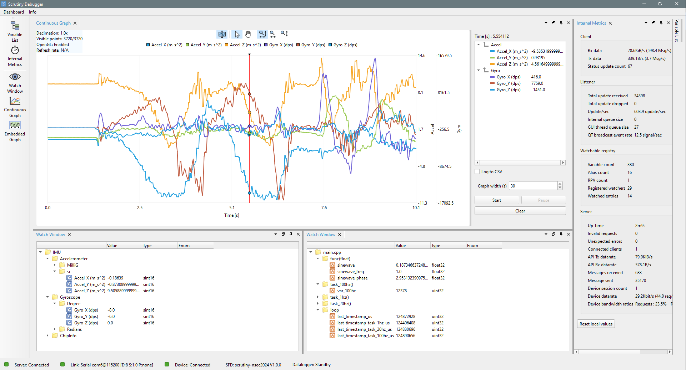

    Scrutiny GUI in action

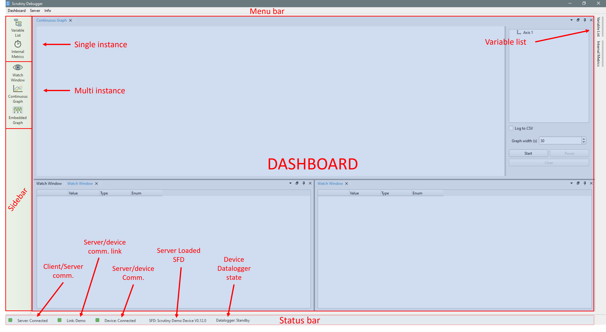

    Scrutiny GUI main sections

First steps
-----------

Opening the GUI without any configuration will display a blank dashboard and a status bar indicating ``Server : Disconnected``.

To establish full communication with a device, you must first connect to a server and then configure that server
to scan for a device using the appropriate communication link (Serial, :ref:`CAN <glossary>`, :ref:`RTT <glossary>`, etc.)

Connecting to a server
######################

First, click the server connection label to open the popup menu, then select "Configure"

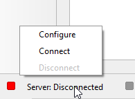

    Server configuration menu

We have two options:

1. Connect to an already running remote server using a :ref:`TCP<glossary>` endpoint (host and port).
2. Start a local server as a subprocess and connect to it.

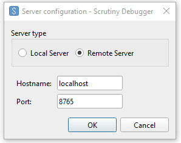

    Remote server configuration dialog

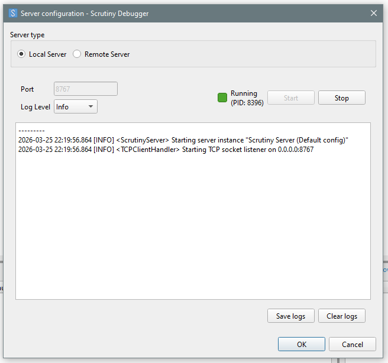

    Local server configuration dialog

Connecting to a device
######################

Once communication with the server is established, the next step is to configure the
communication link so the server can reach the device.

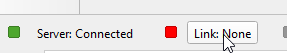

    Open the device link configuration

The available physical communication links are:

- Serial (based of ``pySerial``)
- :ref:`CAN<glossary>` / :ref:`CAN-FD<glossary>` (based of ``python-can``)
- :ref:`UDP/IP<glossary>`
- Jlink :ref:`RTT<glossary>` (based of pylink-square)

Additionally, it is possible to request the server to run a virtual device to try the user interface.

.. note::

    The Scrutiny server is designed to make it easy to extend the list of supported communication channels.
    If you would like to add support for a new communication channel, please open an issue on GitHub so we can discuss the implementation.

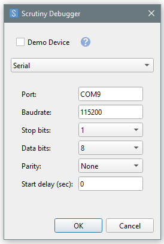

    Serial configuration dialog

The information provided in the dialog is passed to the SDK function  ``ScrutinyClient::configure_device_link()``

Once the communication channel is configured, the server opens it and begins polling for a device.

The status indicator next to the "Link" label shows whether the server successfully initialized the communication channel.
If initialization fails, the cause should be available in the server logs.

Example:

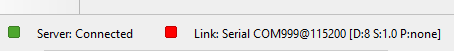

    Unavailable communication channel (inexistant COM port)

If the port opens successfully, the indicator light turns green, and the device-connection status updates to reflect
the state of the communication with the device.

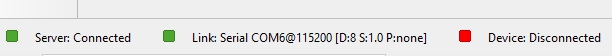

    Open port, no device responding

If a device is expected to start responding but does not, the server logs are the first place to check.
Consider launching the server with a log level of ``debug`` or even ``dumpdata`` to inspect each payload.

Once a device starts responding to the server, the third indicator light should turn green.
By clicking the "Device" label, you can view the configuration that was polled during the server's handshake phase.

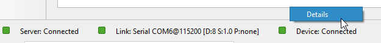

    Device connected

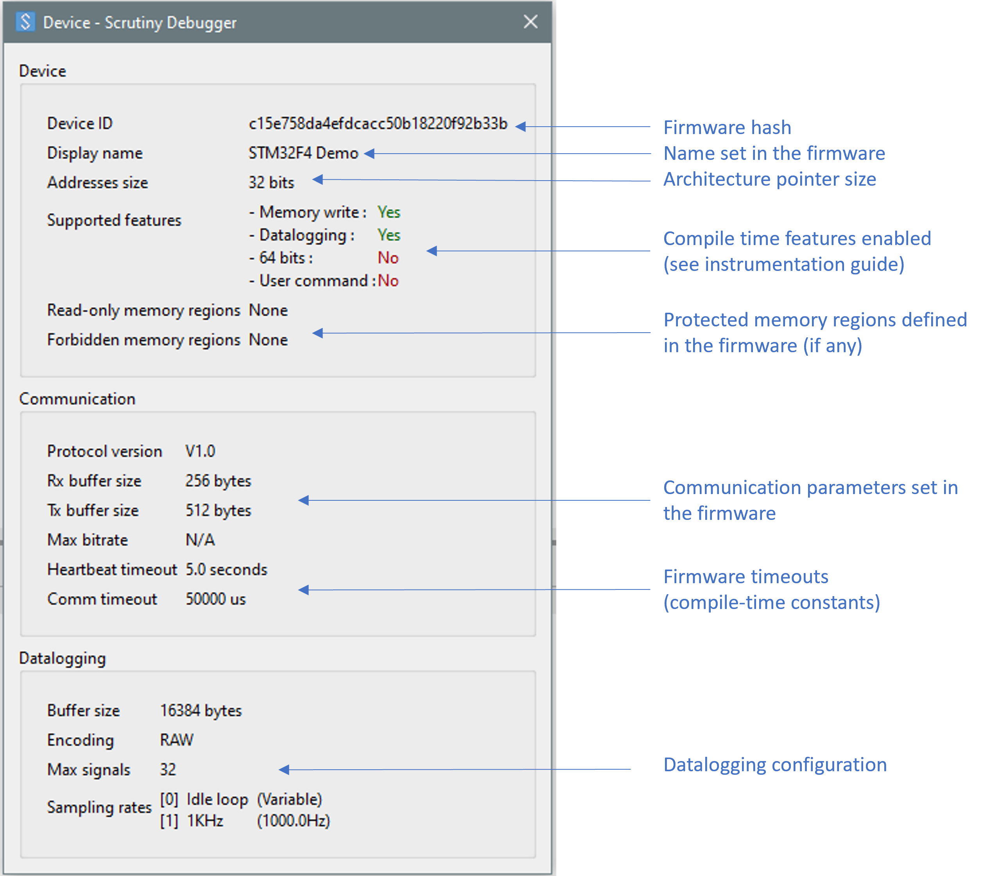

    Device details dialog

As soon as a device is connected, the Runtime Published Values (green items) become available in the Variable List.

If the server has an :ref:`SFD<page_sfd>` installed that matches the Firmware ID reported by the device, it will automatically load it.
Loading an SFD adds variables and aliases to the Variable List widget.

When an SFD is loaded, the project name (taken from the SFD metadata) is displayed in the status bar.

    Actively Loaded SFD

Clicking the label opens a dialog that displays the SFD metadata.

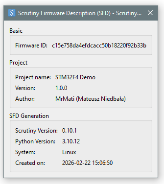

    Loaded SFD metadata dialog

The dashboard
-------------

The dashboard is based of the excelent `QT Advanced Docking System <https://githubuser0xffff.github.io/Qt-Advanced-Docking-System/>`__ project.
It consists of a docking library that allows you to create a visual layout containing various types of widgets.

To avoid confusion with Qt's own Widget terminology, we refer to dockable elements as  ``Dashboard Components``.
The dashboard components provided by Scrutiny are available in the left sidebar.

There are two types of dashboard components: those that allow only a single instance (top section) and those that allow multiple instances (bottom section).

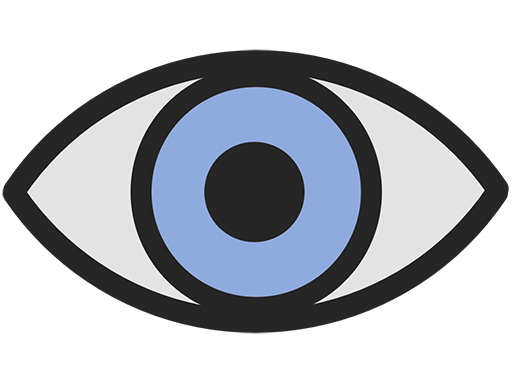

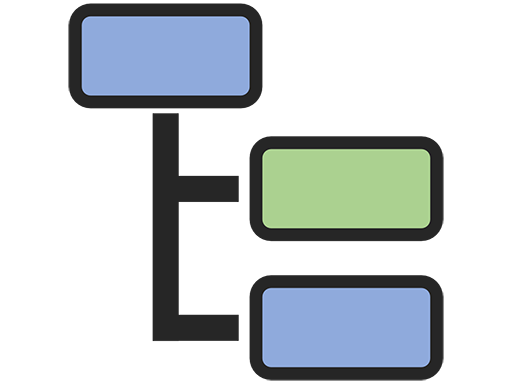

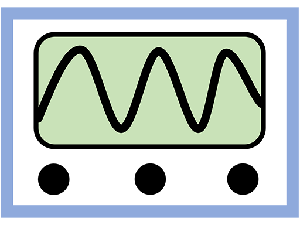

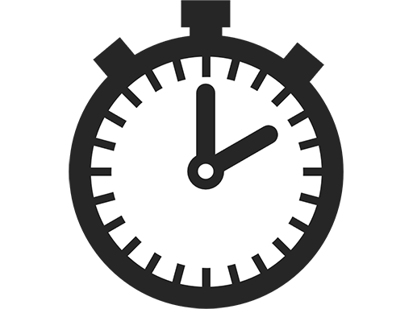

.. csv-table::
    :widths: 10 15 10 65
    :header-rows: 1
    :align: left

    "Icon",                 "Components Name",  "Instance", "Description"
    "|VarListIcon|",        "Variable List",    "Single",   "Displays the available watchable elements (Variables, Aliases, :ref:`RPVs<glossary>`)."
    "|InternalMetricIcon|", "Internal Metrics", "Single",   "Displays statistics about current Scrutiny performances, including polling data rates."
    "|WatchIcon|",          "Watch Window",     "Multiple", "Displays the real-time values of watchable elements dropped into it via drag & drop. The layout can be reorganized as needed."
    "|ContinuousGraphIcon|", "Continuous Graph", "Multiple", "Creates a graph of the real-time values of the selected watchable elements. The sampling rate is configurable, and the acquisition length is unlimited."
    "|EmbeddedGraphIcon|",  "Embedded Graph",   "Multiple", "Configures and displays graphs obtained through the datalogging feature. The sampling rate depends on the device and is typically stable. The acquisition length depends on the size of the datalogging buffer."

.. _watch_window_component:

Watch Window Component
######################

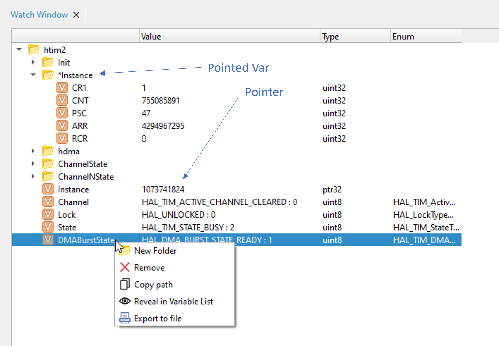

    Watch Window Component

In the screenshot above, we see a variable structure, in this case, the  ``htim2`` timer instance from the STM32 demo.
The tree structure can be edited freely once it is in the Watch window.
Each row is tied to its server path and retains its link to the data source even if renamed or reorganized.

When a watchable element is added to a Watch window, the GUI subscribes to the server for
updates at a rate defined by :ref:`SCRUTINY_GUI_WATCH_UPDATE_RATE<advanced_options>`.

When a folder is collapsed (hiding its variables), the GUI immediately unsubscribes the hidden variables from the server.
This can free bandwidth on the device communication channel, allowing the server to increase the refresh rate for the remaining visible variables.
The same behavior occurs when an entire watch window becomes hidden behind another tab.

Values can be exported to a file in the ``.scval`` format. When exporting, a snapshot of the current
values is taken and saved to a file that can be reimported later.
This can be useful for loading a predefined set of parameters to bring a device into a known state.

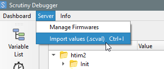

    Server value import

Additionally, note that in the screen capture we have a pointed variable, identifiable by the asterisk in its name.
For more information about pointed variables, see the :ref:`elf2varmap <cmd_elf2varmap>` command.

In this example, the pointer refers to a structure. The pointer is named ``Instance`` and is of type ``ptr32``.
The pointed variables are nested under ``*Instance`` and may be of any type.
All of them can be read or written; the server supports pointer dereferencing.

If a pointer is set to ``0``, the Scrutiny server will refuse to read it and will report an invalid value.

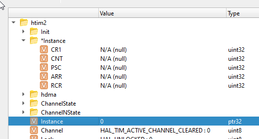

    Null pointer dereferencing refused by the server

.. warning::

    Be very careful when changing the value of a pointer as it can cause a runtime crash of your device.

.. _continuous_graph_component:

Continuous Graph Component
##########################

The continuous graph is generated entirely by the GUI. The server and the device have no knowledge of its existence.

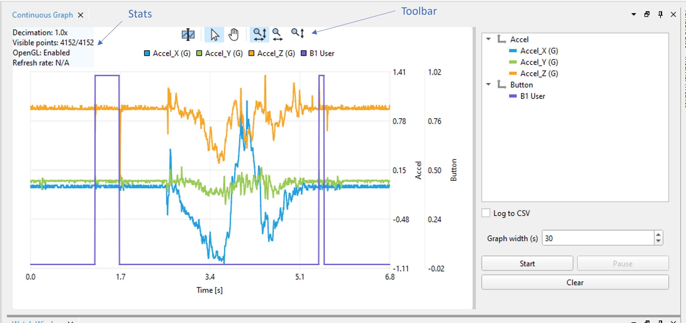

    Continuous Graph Component

When an acquisition is started, the GUI subscribes to the requested watchable elements on the server and plots,
in real time, the values broadcast by the server until the acquisition is stopped. The subscription to the server
required the highest update rate possible.

Watchable elements (Variables, Aliases, and RPVs) can be dragged and dropped onto the axes region.
Both axes and watchable elements can be renamed freely for the duration of the acquisition.

Because the server's broadcast rate is variable, the sampling rate of this graph is also variable,
and sample synchronization is not guaranteed.
This means that even when two variables are plotted together, their samples may arrive independently.
Zooming in closely on the timeline will reveal that the samples are not aligned on the time axis.

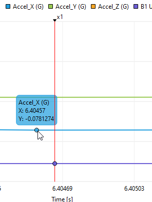

    Unaligned samples

The continuous graph is designed to run indefinitely. The GUI retains only a limited number of samples and displays them in a moving window.
To preserve all received values, CSV logging can be enabled.

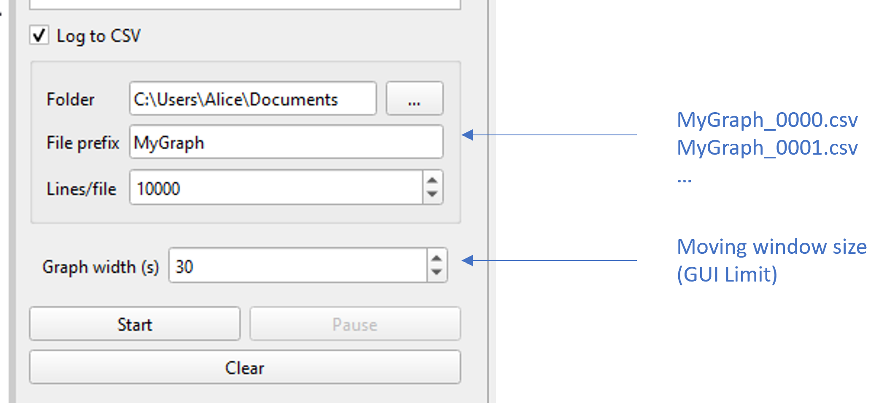

    CSV Logging

The CSV export is split into multiple files, each with a numbered suffix that increments whenever a new file is created.

Each time a new value is received, a new row is appended to the CSV file.
Columns that do not receive an updated value retain their previous value.
An additional column labeled ``New Values`` indicates, using a boolean flag, which columns were updated in that row.

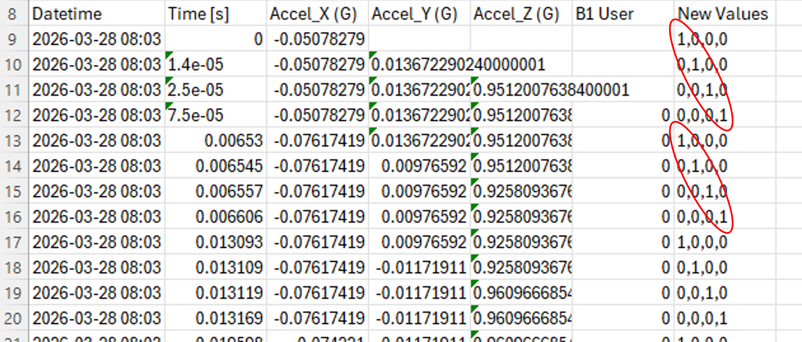

    New Values column meaning

In the screenshot above, we can see that not all values are updated on every row.
We can also observe the server's round-robin polling behavior across variables.

.. _embedded_graph_component:

Embedded Graph Component
########################

The embedded graph component provides an interface for configuring the datalogging feature of the Scrutiny Embedded library.

During an acquisition, both the server and the device participate in the process. The GUI simply displays the resulting data.
See the timing diagram below.

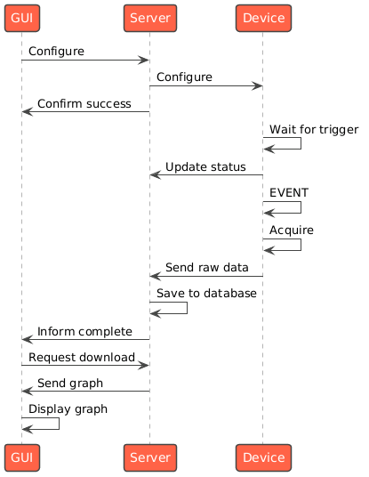

    Embedded graph acquisition order of events

Rather than plotting the real-time value stream from the server, the embedded graph requires the device
itself to monitor a software condition and log a set of variables.
When the software condition is met, the logging process completes and the collected data is returned to the server.

Unlike the continuous graph, the communication link between the device and the server is not a limiting factor for the embedded graph.
Instead, the primary limitation is the size of the datalogging buffer. The sampling rate is steady and reliable
(unless the firmware task responsible for logging is jittery) and the total acquisition length depends on both the amount of memory
allocated to datalogging and the number of signals being recorded.

Also, all samples in the embedded graph are aligned across all data series with respect to the X-axis (contrary to the Continuous Graph).

The user can configure the sampling rate with optional decimation, the software trigger condition, the trigger position within the buffer,
and a condition-debouncing delay called the "Hold time".

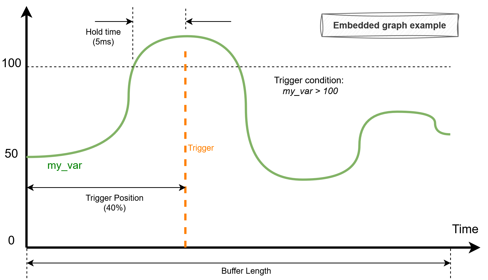

    Embedded graph parameters

my_var
    Fictive embedded variable that evolves over time.

Trigger condition
    A user defined condition that must evaluate to true for the given hold time to fires the trigger event.

Hold time
    The amount of time that a trigger condition must evaluate to true before firing the trigger event.

Buffer length
    Length of the acquisition defined by the datalogging buffer size and the number/type of the logged signals.

Trigger position
    Position of the trigger event inside the acquisition window specified in percentage where 0% is leftmos 50% center and 100% rightmost. When on left, the user can see what happened after the event, and before the event when on right.

The parameters described above can be configured as shown below:

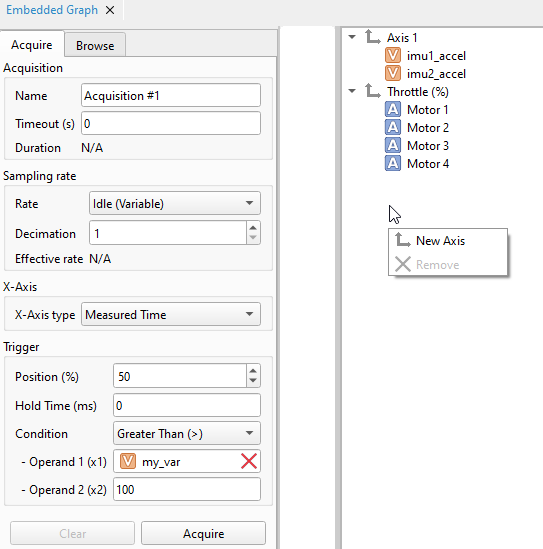

    Embedded graph configuration window

The operands can be either a literal value or a watchable element that has been dragged and dropped into the text box.

**X-Axis Type**

The are four options for the X-Axis type.

Indexed
    The X-axis values are unitless. Each sample is numbered from 0 to N-1, where N is the total number of samples.

Measured Time
    The X-axis represents time, in seconds. The timestamps are generated by the device.
    Using this type of axis reduces the total acquisition length, as it consumes additional space in the datalogging buffer.

Ideal Time
    The X-axis represents time, in seconds. The timestamps are generated by the server by creating a linear time series based on the sampling‑rate frequency.
    This mode does not consume space in the datalogging buffer and is available only when the sampling rate is fixed.
    It is not available for variable-frequency sampling rates.

Signal
    The X-axis is provided by a watchable element that is acquired by the device as part of the datalogging process.
    It can be any watchable element that has been dragged and dropped into the appropriate field (visible only when this option is selected).

**Trigger condition**

Moving on, the possible trigger conditions are listed below:

.. csv-table::
    :header-rows: 1
    :align: left

    "Condition",                "Number of Operands",   "Formula"
    "Always True",              "0",                    "``true``"
    "Equal (=)",                "2",                    "``x1 = x2``"
    "Not Equal (!=)",           "2",                    "``x1 != x2``"
    "Greater Than (>)",         "2",                    "``x1 > x2``"
    "Greater or Equal (>=)",    "2",                    "``x1 >= x2``"
    "Less Than (<)",            "2",                    "``x1 < x2``"
    "Less or Equal (<=)",       "2",                    "``x1 <= x2``"
    "Change More Than",         "2",                    "``|dx1| > |x2| & sign(dx1) = sign(x2)``"
    "Is Within",                "3",                    "``|x1 - x2| < |x3|``"

Finally, every acquisition taken by the server can be reloaded from a database

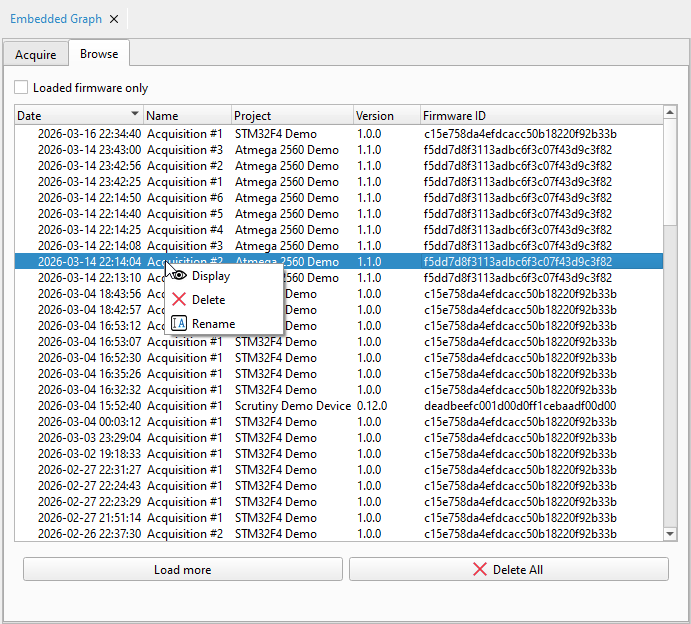

    Embedded graph storage navigation

Stored acquisition can be loaded or delete. When checking the "Loaded firmware only", the list
of displayed acquisition will be filtered to only show those with a Frimware ID matching the actually
loaded :ref:`SFD <page_sfd>` file on the server.

Editing, saving and reloading
#############################

The dashboard can be edited at will by drag & drop actions.
Components can also be docked to any side of the dashbaord renamed or detached to make a whole new window.
Each new window can itself be turned to a new docking zone by drag & dropping other components to them

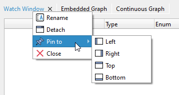

    Dashboard tab menu

Dashboards can be saved and reloaded to a JSON based file format

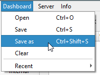

    Dashboard save & reload menu

SFD management
--------------

Once connected to a server, it is possible to install remotely or download SFD files from the server.

By clicking the menu bar menu : ``Server`` --> ``Manage Firmware``, the following dialog is shown.

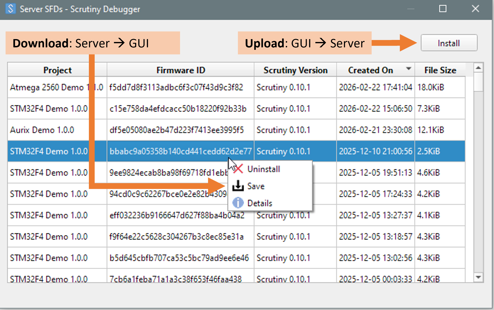

    Managing the server SFDs

.. _advanced_options:

Advanced Options
----------------

To GUI can be launched with extra options, refers to the :ref:`GUI command line options<cmd_gui>`.

Additionally, there are few very technical options that can be controlled through environment variables.

QT_QPA_PLATFORM
    This variable is handled directly by Qt. It defines which low-level windowing system will be used to create application windows.
    If this value is not set, the system default is used unless Scrutiny overrides it. Scrutiny will override this value only when a
    known incompatibility exists.

    This is the case on Linux systems using Wayland, which is known to cause rendering issues with the dashboard. In such situations,
    Scrutiny requests X11 instead of Wayland.

SCRUTINY_GUI_SERVER_THROTTLING_RATE (default 4000)
    Upon connecting to a server, the GUI configures it to respect a maximum broadcast rate (in updates per second).
    This limit is a hard cap designed to prevent the server from overwhelming the GUI if the server happens to run
    significantly faster than the GUI can process updates.
    A value of 0 disables the limit.

SCRUTINY_GUI_MAX_GENERATED_VAR_PER_ELEMENT (default: 1024)
    Defines the maximum number of elements allowed in an array. If an array contains more elements than this limit,
    it will not be displayed in the GUI. Large arrays can significantly slow down the interface. For example,
    a 1 MB buffer could result in one million nodes in a TreeView widget (used in the Variable List and Watch components).

SCRUTINY_GUI_MAX_TOTAL_GENERATED_VAR (default : 65536)
    Defines a hard limit on the number of array elements that can be created.
    If this limit is reached, no additional array elements are displayed in the GUI.

    This serves as a fallback mechanism to prevent the GUI from hanging when the server connects to a device
    that exposes an unreasonable number of array elements.

SCRUTINY_GUI_WATCH_UPDATE_RATE (default : 15)
    Defines the update rate requested from the server when displaying a watchable in a
    :ref:`Watch Window component<watch_window_component>`. A value of 0 requests the server to poll as quickly as possible.
    This setting only takes effect if no other widgets or clients are monitoring the same watchable at a higher update rate.

SCRUTINY_GUI_HMI_UPDATE_RATE (default : 15)
    Defines the update rate requested from the server when displaying a watchable in a
    :ref:`HMI component<hmi_component>`. A value of 0 requests the server to poll as quickly as possible.
    This setting only takes effect if no other widgets or clients are monitoring the same watchable at a higher update rate.
