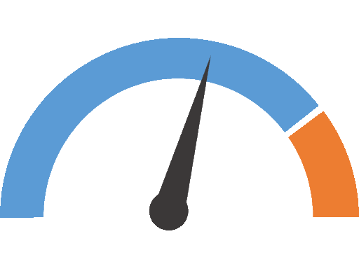

Graphical User Interface (GUI)
==============================

The graphical user interface (GUI) is included in the Scrutiny package and can be launched using the command ``scrutiny gui``.

The GUI is implemented in Python and built with the Qt framework through the PySide6 package.
It acts as a Scrutiny client and communicates with the server using the `Python SDK <page_sdk>`.
Anything you can do in the GUI can also be performed programmatically through a script.

Let's take a first look at the GUI.

.. figure:: _static/ui/scrutiny_light.png

    Scrutiny GUI in action

.. figure:: _static/ui/scrutiny_gui_sections.png

    Scrutiny GUI main sections

First steps
-----------

Opening the GUI without any configuration will display a blank dashboard and a status bar indicating ``Server : Disconnected``.

To establish full communication with a device, you must first connect to a server and then configure that server
to scan for a device using the appropriate communication link (Serial, :ref:`CAN <glossary>`, :ref:`RTT <glossary>`, etc.)

Connecting to a server
######################

First, click the server connection label to open the popup menu, then select "Configure"

.. figure:: _static/ui/server_config_menu.png
    :height: 3cm

    Server configuration menu

We have two options:

1. Connect to an already running remote server using a :ref:`TCP<glossary>` endpoint (host and port).
2. Start a local server as a subprocess and connect to it.

.. figure:: _static/ui/remote_server_dialog.png
    :height: 6cm

    Remote server configuration dialog

.. figure:: _static/ui/local_server_dialog.png
    :height: 10cm

    Local server configuration dialog

Connecting to a device
######################

Once communication with the server is established, the next step is to configure the
communication link so the server can reach the device.

.. figure:: _static/ui/status_bar_link_label.png
    :height: 1cm

    Open the device link configuration

The available physical communication links are:

- Serial (based on ``pySerial``)
- :ref:`CAN<glossary>` / :ref:`CAN-FD<glossary>` (based on ``python-can``)
- :ref:`UDP/IP<glossary>`
- Jlink :ref:`RTT<glossary>` (based on pylink-square)

Additionally, it is possible to request the server to run a virtual device to try the user interface.

.. note::

    The Scrutiny server is designed to make it easy to extend the list of supported communication channels.
    If you would like to add support for a new communication channel, please open an issue on GitHub so we can discuss the implementation.

.. figure:: _static/ui/serial_config_dialog.png
    :height: 8cm

    Serial configuration dialog

The information provided in the dialog is passed to the SDK function ``ScrutinyClient::configure_device_link()``.

Once the communication channel is configured, the server opens it and begins polling for a device.

The status indicator next to the "Link" label shows whether the server successfully initialized the communication channel.
If initialization fails, the cause should be available in the server logs.

Example:

.. figure:: _static/ui/serial_com999.png
    :height: 1cm

    Unavailable communication channel (nonexistent COM port)

If the port opens successfully, the indicator light turns green, and the device-connection status updates to reflect
the state of the communication with the device.

.. figure:: _static/ui/port_opened_no_device.png
    :height: 1cm

    Open port, no device responding

If a device is expected to start responding but does not, the server logs are the first place to check.
Consider launching the server with a log level of ``debug`` or even ``dumpdata`` to inspect each payload.

Once a device starts responding to the server, the third indicator light should turn green.
By clicking the "Device" label, you can view the configuration that was polled during the server's handshake phase.

.. figure:: _static/ui/device_connected_details_menu.png
    :height: 1cm

    Device connected

.. figure:: _static/ui/device_details_dialog.png
    :height: 12cm

    Device details dialog

As soon as a device is connected, the Runtime Published Values (green items) become available in the Variable List.

If the server has an :ref:`SFD<page_sfd>` installed that matches the Firmware ID reported by the device, it will automatically load it.
Loading an SFD adds variables and aliases to the Variable List widget.

When an SFD is loaded, the project name (taken from the SFD metadata) is displayed in the status bar.

.. figure:: _static/ui/status_bar_link_label.png
    :height: 1cm

    Actively Loaded SFD

Clicking the label opens a dialog that displays the SFD metadata.

.. figure:: _static/ui/sfd_details_dialog.png
    :height: 6cm

    Loaded SFD metadata dialog

The dashboard
-------------

The dashboard is based on the excellent `QT Advanced Docking System <https://githubuser0xffff.github.io/Qt-Advanced-Docking-System/>`__ project.
It consists of a docking library that allows you to create a visual layout containing various types of widgets.

To avoid confusion with Qt's own Widget terminology, we refer to dockable elements as ``Dashboard Components``.
The dashboard components provided by Scrutiny are available in the left sidebar.

There are two types of dashboard components: those that allow only a single instance (top section) and those that allow multiple instances (bottom section).

.. |WatchIcon| image:: _static/ui/icons/watch.png
   :width: 32px

.. |VarListIcon| image:: _static/ui/icons/varlist.png
   :width: 32px

.. |ContinuousGraphIcon| image:: _static/ui/icons/continuous-graph.png
   :width: 32px

.. |EmbeddedGraphIcon| image:: _static/ui/icons/embedded-graph.png
   :width: 32px

.. |InternalMetricIcon| image:: _static/ui/icons/stopwatch.png
   :width: 32px

.. tabularcolumns:: >{\centering}m{0.1\linewidth} m{0.15\linewidth} m{0.1\linewidth} m{0.65\linewidth}

.. csv-table:: Dashboard components
    :header-rows: 1

    "Icon",                 "Component Name",          "Instance", "Description"
    "|VarListIcon|",        "Variable List",            "Single",   "Displays the available watchable elements (Variables, Aliases, :ref:`RPVs<glossary>`)."
    "|InternalMetricIcon|", "Internal Metrics",         "Single",   "Displays statistics about current Scrutiny performances, including polling data rates."
    "|WatchIcon|",          "Watch Window",             "Multiple", "Displays the real-time values of watchable elements dropped into it via drag & drop. The layout can be reorganized as needed."
    "|ContinuousGraphIcon|", "Continuous Graph",        "Multiple", "Creates a graph of the real-time values of the selected watchable elements. The sampling rate is configurable, and the acquisition length is unlimited."
    "|EmbeddedGraphIcon|",  "Embedded Graph",           "Multiple", "Configures and displays graphs obtained through the datalogging feature. The sampling rate depends on the device and is typically stable. The acquisition length depends on the size of the datalogging buffer."
    "|HMIIcon|",            "Human Machine Interface",  "Multiple", "Creates a customizable dashboard with user defined widgets tied to watchables. This dashboard can serve as Human Machine Interface with buttons, sliders, gauges, etc."

.. include:: _gui/gui_watch_component.rst.txt

.. include:: _gui/gui_continuous_graph_component.rst.txt

.. include:: _gui/gui_embedded_graph_component.rst.txt

.. include:: _gui/gui_hmi_component.rst.txt

Editing, saving and reloading the dashboard
###########################################

The dashboard can be edited at will by drag & drop actions.
Components can also be docked to any side of the dashboard, renamed, or detached to create a standalone window.
Each new window can itself become a docking zone by drag & dropping other components into it.

.. figure:: _static/ui/dashboard/dashboard-tab-menu.png
    :height: 3cm

    Dashboard tab menu

Dashboards can be saved and reloaded in a JSON-based file format.

.. figure:: _static/ui/dashboard/dashboard-save-reload.png
    :height: 4cm

    Dashboard save & reload menu

SFD management
--------------

Once connected to a server, it is possible to install remotely or download SFD files from the server.

By clicking the menu bar menu : ``Server`` --> ``Manage Firmware``, the following dialog is shown.

.. figure:: _static/ui/sfd-management-dialog.png
    :height: 10cm

    Managing the server SFDs

.. _advanced_options:

Advanced Options
----------------

The GUI can be launched with extra options; refer to the :ref:`GUI command line options<cmd_gui>`.

Additionally, there are a few highly technical options that can be controlled through environment variables.

QT_QPA_PLATFORM
    This variable is handled directly by Qt. It defines which low-level windowing system will be used to create application windows.
    If this value is not set, the system default is used unless Scrutiny overrides it. Scrutiny will override this value only when a
    known incompatibility exists.

    This is the case on Linux systems using Wayland, which is known to cause rendering issues with the dashboard. In such situations,
    Scrutiny requests X11 instead of Wayland.

SCRUTINY_GUI_SERVER_THROTTLING_RATE (default 4000)
    Upon connecting to a server, the GUI configures it to respect a maximum broadcast rate (in updates per second).
    This limit is a hard cap designed to prevent the server from overwhelming the GUI if the server happens to run
    significantly faster than the GUI can process updates.
    A value of 0 disables the limit.

SCRUTINY_GUI_MAX_GENERATED_VAR_PER_ELEMENT (default: 1024)
    Defines the maximum number of elements allowed in an array. If an array contains more elements than this limit,
    it will not be displayed in the GUI. Large arrays can significantly slow down the interface. For example,
    a 1 MB buffer could result in one million nodes in a TreeView widget (used in the Variable List and Watch components).

SCRUTINY_GUI_MAX_TOTAL_GENERATED_VAR (default : 65536)
    Defines a hard limit on the number of array elements that can be created.
    If this limit is reached, no additional array elements are displayed in the GUI.

    This serves as a fallback mechanism to prevent the GUI from hanging when the server connects to a device
    that exposes an unreasonable number of array elements.

SCRUTINY_GUI_WATCH_UPDATE_RATE (default : 15)
    Defines the update rate requested from the server when displaying a watchable in a
    :ref:`Watch Window component<watch_window_component>`. A value of 0 requests the server to poll as quickly as possible.
    This setting only takes effect if no other widgets or clients are monitoring the same watchable at a higher update rate.
