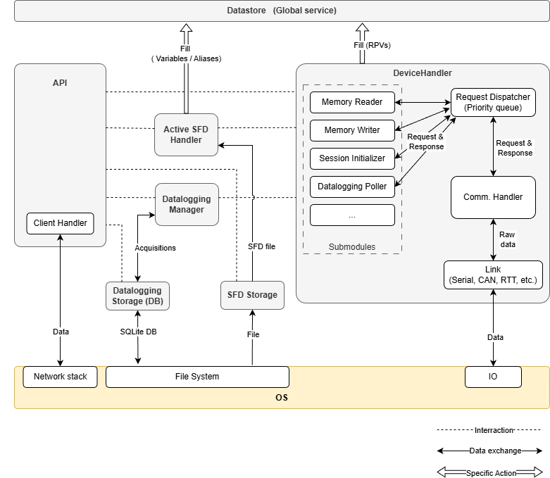

Server
======

The Scrutiny server is the central component of the system. It maintains active communication with the device and
arbitrates requests from multiple clients.

Internal Architecture
---------------------

The internal architecture of the server is not required to use Scrutiny.
However, understanding it can help interpret system behavior and make the logs easier to follow.
The architecture is shown below.

API
    Application Programming Interface. Decodes client requests, invokes the appropriate internal functions, and returns a response to the client.

API > Client Handler
    Internal abstraction layer for the underlying OS owned communication mean.
    Scrutiny uses a TCP connection by default, but this layer can be replaced with another transport technology if needed, such as WebSockets or others.

Datastore
    Central storage for all watchable elements. It is populated by the **Device Handler** (for :ref:`RPVs <glossary>`) and by the loaded SFD (for Variables and Aliases).
    When reading device memory, the **Device Handler** updates the datastore, which then triggers the API callbacks.
    When writing to device memory, the **Datastore** queues write requests, and the **Device Handler** processes this queue to schedule writes on the device.

Active SFD Handler
    This module monitors the state of the device communication and automatically loads or unloads an :ref:`SFD file <page_sfd>`.
    When doing so, it either populates or clears the **Datastore**

Datalogging Manager
    Datalogging management module.
    It prioritizes requests, translates API data to device-level data, interprets device responses,
    and manages read/write access to the acquisition database.

Datalogging Storage
    Abstraction layer over the datalogging acquisition storage. The storage backend is a SQLite database.

SFD Storage
    Abstraction layer over the Scrutiny Firmware Description file storage. Files are stored in a dedicated data directory.

Device Handler
    Main component that maintains active communication with the device and provides an interface for other modules to interact with it.
    The Device Handler contains several submodules that can run independently and are responsible for generating requests to the device and handling its responses.

Device Handler > Request Dispatcher
    A priority-based queue that dispatches requests from all submodules one at a time.

Device Handler > Comm. Handler
    The state layer converts high-level Requests and Responses into byte-level payloads and is responsible for
    keeping the communication **Link** open and functional.
    Timeout detection occurs at this level.

Device Handler > Link
    Abstraction layer over the communication channel used to reach a device.
    This is the layer that must be implemented to support a new type of communication channel.

Device Handler > Session Initializer
    This submodule initializes a session with a device. After completing the handshake phase, it signals the Device Handler
    to transition its internal state machine to the Active state and provides the device configuration to the rest of the server.

Device Handler > Datalogging Poller
    A module that continuously polls the device for its datalogging status. It maintains a state machine to track the progress
    of an acquisition and resets the device datalogger if its internal state becomes inconsistent.
    It receives its instructions from the server's **Datalogging Manager**

Device Handler > Memory Writer
    Reads the write-request queue in the **Datastore** and sends write requests to the device.
    This module has higher priority than the **Memory Reader**.

Device Handler > Memory Reader
    Keeps track of the watched entries in the **Datastore** and dispatches memory-read requests to the device
    to keep their values up to date.
    It reads the watched entries in a round-robin fashion and packs as many as possible into each request.
    Variables that occupy contiguous memory regions are aggregated into a single block read to improve bandwidth efficiency.

Configuration
-------------

The server can be launched with a configuration, provided either through a file or through command-line options.

The configuration file is passed using the ``--config`` argument.
This file contains a JSON‑formatted configuration with nested key/value pairs.
Each parameter defined in the configuration file can also be overridden from the command line by
using dot notation (``.``) to represent nesting levels.

.. code-block:: json

    {
        "section1": {
            "key1" : 123,
            "subsection2" : {
                "key3" : "hello"
            }
        }
    }

Launching the server with the following command line is equivalent to providing the configuration file shown above.

.. code-block:: bash

    $ scrutiny server --options section1.key1=123 section1.subsection2.key3=hello

Possible configuration
######################

name
    Name assigned to this server instance. Used only for log output.

autoload_sfd
    When set to ``false``, the server does not load an SFD when a device connects. Mostly useful for unit testing.

debug
    When set to ``true``, invoke the ``ipdb`` module upon reception of a ``debug`` payload through the API. Helps narrow down hard to reproduce bugs.

api.client_interface_type
    Type of abstraction layer for the **API**. Supports ``tcp`` for production or ``dummy`` for testing. Could be extended in the future.

api.client_interface_config.host (type: ``tcp``)
    IP address to bind the listening socket to.

api.client_interface_config.port (type: ``tcp``)
    TCP port to bind the listening socket to.

device.response_timeout
    Timeout for the **Device Handler** to receive a response to a request. Defaults to 1.0 seconds.

device.heartbeat_timeout
    Heartbeat timeout value. The effective timeout is the minimum between this value and the device's ``SCRUTINY_COMM_HEARTBEAT_TIMEOUT_US`` constant.
    The server sends heartbeat messages at a rate faster than this timeout (about every 75% of the effective value).

device.max_request_size
    Maximum request size the server may send to the device. The effective size is the minimum between this value and the device's RX buffer size.

device.max_response_size
    Maximum response size the device may send. The effective size is the minimum between this value and the device's TX buffer size.

    This value is used when calculating payload sizes, since both the request and the response must fit within the device buffers.

device.max_bitrate_bps
    Maximum bitrate between the server and the device.
    The effective bitrate is the minimum between this value and the device's configured bitrate.
    A value of ``0`` or ``null`` means no throttling.

device.default_address_size
    Default protocol address size used when no device is connected. Overridden by the device upon connection.
    Primarily used for unit testing.

device.default_protocol_version
    Default protocol version used when no device is connected. Overridden by the device upon connection.
    Primarily used for unit testing.

device.link_type
    Type of communication link to use at startup. This value can be changed dynamically by clients through the **API**.
    Supported values: ``udp``, ``serial``, ``rtt``, ``canbus``

device.link_config
    Configuration for the device link. This must be a dictionary whose structure depends on the value of ``device.link_type`` parameter.
    Each link type defines its own configuration schema.

    The possible configuration fields for each link type are not detailed here, as they mirror the options provided by the
    :ref:`Python SDK<page_sdk>` offers.
