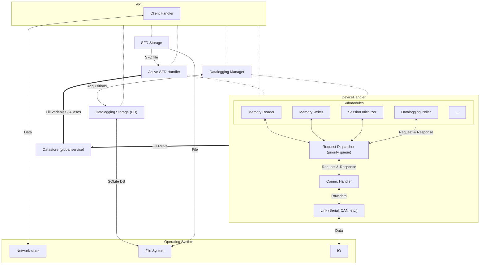

This module contains the server code.
The server maintains the communication with a device and talks with clients. It therefore runs 3 threads
 - 1 thread for client communication IO
 - 1 thread for device communication IO
 - 1 thread for the logic

Both IO threads waits on IO to wake up. When data is received, they set a global ``threading.Event`` object. The main logic thread waits for that Event to be set or timeout.

# Modules

Below is a description of the architecture. One can also look at the user guide in  ``docs/user_guide``. specifically the ``server.rst`` that contains a section about the architecture

## Datastore

The datastore is a global service that can store "entries" that mainly have a path, name and a value.

Each entry can be subscribed for watching. Whenever a value is updated, all watchers gets notified.

There are 3 main types of entries :
  - ``DatastoreVariableEntries`` : Associated with a variable that has a memory location, size, endianness and char_bit.
  - ``DatastoreRPVEntries`` : Associated with an RPV that has an ID and a type
  - ``DatastoreAliasEntry`` : An entry associated with another datastore entry.

Variable and Aliases are loaded in the datastore when a SFD is loaded by the ``ActiveSFDHandler``.
RPVs are loaded when a device connects.

It is also possible to register ``VariableFactory`` to the datastore. Those can instantiate Variable entries on demand by decoding information from an entry path. They are used to instantiate array elements. Example: if a path is ``/aa/bb[1][2]/cc``, and the datastore has a Factory registered at ``/aa/bb/cc``, the factory will try to instantiate a single Variable entry that match to the specific element indexed by the path.

There is also an extension of the ``DatastoreVariableEntries`` called the ``DatastorePointedVariableEntry``. This is used to resolve pointers. The address of the latter is computed from the value of another variable in the datastore, rather than being fixed.

The datastore is central to the server. It is used like this:

- When a client subscribe to a variable, the API add a watcher to the datastore, identified by an ID associated with the client socket.
- When an Entry is being watched, the datastore inform the ``DeviceHandler`` (mainly the ``MemoryReader`` submodule) so it can start polling the values.
- When a value is received by the ``DeviceHandler``, it is written to the datastore which itself invokes a callback for each watcher. These callbacks are mostly functions owned by the API that will stream the data to the clients.

## DeviceHandler

The ``DeviceHandler`` is the module that keeps an active communication with the device and talks with the embedded library. It must be configured to use a communication link (Serial, CAN bus, UDP, etc.). Once it can open a communication channel, it continuously search for a device, sending ``DISCOVER`` requests. When a device respond, it initiate a handshake to learn what this device is and get its configuration.

When a connection to a device is established, an event is generated which causes:
 - The API to inform the clients
 - Another module called the "ActiveSFDHandler" to fill the datastore with Variables and Aliases if a SFD file with a matching Firmware ID is available.

While doing the handshake with the device, the ``DeviceHandler`` request for a list of RPVs defined in the device. That list obtained from the handshake is used to fill the datastore with RPVs.  It is important to understand that RPVs and Variables/Aliases are added at different times and can be totally independent events (although one generally happens after the other).

The ``DeviceHandler`` mainly runs a state machine that enables/disables submodules.
Each submodules act as a request generator. They can generate requests for the device. Those requests are given to a module called ``RequestDispatcher`` that essentially runs a priority queue.
The requests are then picked by the ``CommHandler``, sent to the device and the response is then forwarded back to a callback owned by the submodule.

The ``DeviceHandler`` state machine does this flow in normal operation.

``INIT`` -> ``WAIT_COMM_LINK`` -> ``WAIT_CLEAN_STATE`` -> ``DISCOVERING`` -> ``CONNECTING`` -> ``POLLING_INFO`` -> ``WAIT_DATALOGGING_READY`` -> ``READY`` -> ``DISCONNECTING``

The role of each states are:
 - ``INIT`` : Entry point
 - ``WAIT_COMM_LINK`` : Waits for the device link to be opened and operational
 - ``WAIT_CLEAN_STATE`` : Wait for all submodule to report a "ready" state
 - ``DISCOVERING`` : Runs the ``DeviceSearcher`` until a device is found. This submodule periodically emits ``DISCOVER`` requests
 - ``CONNECTING`` : Runs the ``SessionInitializer`` until a connection is accepted by the device. This submodule periodically sends ``CONNECT`` requests to the device until it accepts it. The device may respond with a BUSY error code if another server has reserved it. When exiting this state, the ``HeartbeatGenerator`` is enabled to keep the session active.
 - ``POLLING_INFO`` : Runs the ``InfoPoller`` to complete the handshake phase. This submodule will gather a series of information from the device, including (but not limited to) :
   - Firmware ID
   - RX/TX Buffer sizes
   - Datalogging capabilities (buffer size, sampling rates, etc.)
   - Supported features
   - Pointer size
   - Size of bytes
   - Protected memory region
   - RPVs
- ``WAIT_DATALOGGING_READY`` : Enables the ``DataloggingPoller`` and wait for it to have gathered what it needs to work.
- ``READY`` : Communication with the device is ready. In that state, the following submodules all work concurrently:
  - ``DataloggingPoller`` : Execute datalogging operation (configure, acquire, download data). These operation are given by the ``DataloggingManager``
  - ``HeartbeatGenerator`` : Generate periodic heartbeat messages to keep the session active with the device.
  - ``MemoryReader`` : Execute Memory/RPV read requests by polling "watched" datastore entries in a round robin scheme.
  - ``MemoryWriter`` : Execute Memory/RPV write requests by monitoring the datastore for updates requested by the clients

As mentioned, the communications goes to the ``CommHandler``. The ``CommHandler`` consume Requests and generate bytes payload in a direction. In the other direction, it consumes bytes payload and generate responses. The ``CommHandler`` own the ``Link`` object, which is an abstraction layer over a hardware communication channel.

## ActiveSFDHandler
Loads or unloads an SFD file. This means reading the ``SFDStorage`` and filling/emptying the datastore of its entry. It keeps a maximum of a single SFD loaded at all time.

## SFDStorage
Maintains a directory filled with .sfd files, indexed by their firmware ID.

## DataloggingManager
Manage the datalogging service that the server exposes to the clients. What the server offers is not exactly what the server can do.
Example of feature mismatch that the ``DataloggingManager`` deals with are:

- Clients request Watchable logging, the device can log memory location or RPV ids.
- Clients may ask for aliases, the device does not know about them. They must be translated to variable or RPVs
- The device does not care which signal is the X-Axis. The ``DataloggingManager`` keeps track of that.
- The sampling rates must match with a task ID that the device needs to know
- Ideal Time dataseries is generated by the server.
- Measured X-Axis adds a time logging signal to the list of recorded data.

In other words, the ``DataloggingManager`` acts as a translation service between feature exposed to the clients and features offered by the device.
When a datalogging request is translated by the ``DataloggingManager``, it is given to the ``DeviceHandler``, which forwards it to its ``DataloggingPoller`` submodule.
Once a datalogging acquisition is completed, the ``DataloggingManager`` will save it into the ``DataloggingStorage``, which is a sqlite database so it can be fetched later.

## DataloggingStorage
SQLite database storing the acquisition in a format that makes sense to the clients. Dataseries are tied to watchables. Data is converted to floating point numeric values, a data series is labeled as the X-Axis. There is also metadata associated with an acquisition such as the acquisition date.

## API
Translate a request received by a client into a function call. The API has access to most high level modules of the server.
The API talks with the clients by exchanging JSON objects over TCP/IP.

# Architecture diagram

## Legend

| Notation | Meaning |
|---|---|
| `-.-` (dashed, no arrowhead) | Interaction (calls / control, no bulk data) |
| `-->` / `<-->` (thin arrow) | Data exchange |
| `==>` (thick arrow) | Specific action |

## Relationships

| From | To | Type | Payload / label |
|---|---|---|---|
| API | Active SFD Handler | interaction | — |
| API | Datalogging Manager | interaction | — |
| API | DeviceHandler | interaction | — |
| API | Datalogging Storage (DB) | interaction | — |
| API | SFD Storage | interaction | — |
| Active SFD Handler | DeviceHandler | interaction | — |
| Datalogging Manager | DeviceHandler | interaction | — |
| Client Handler | Network stack | data exchange (bidirectional) | Data |
| Datalogging Manager | Datalogging Storage (DB) | data exchange (bidirectional) | Acquisitions |
| Datalogging Storage (DB) | File System | data exchange (bidirectional) | SQLite DB |
| SFD Storage | File System | data exchange | File |
| SFD Storage | Active SFD Handler | data exchange | SFD file |
| Memory Reader | Request Dispatcher | data exchange (bidirectional) | — |
| Memory Writer | Request Dispatcher | data exchange (bidirectional) | — |
| Session Initializer | Request Dispatcher | data exchange (bidirectional) | — |
| Datalogging Poller | Request Dispatcher | data exchange (bidirectional) | Request & Response |
| Request Dispatcher | Comm. Handler | data exchange (bidirectional) | Request & Response |
| Comm. Handler | Link | data exchange (bidirectional) | Raw data |
| Link | IO | data exchange (bidirectional) | Data |
| DeviceHandler | Datastore | specific action | Fill (RPVs) |
| Active SFD Handler | Datastore | specific action | Fill (Variables / Aliases) |

## Diagram

